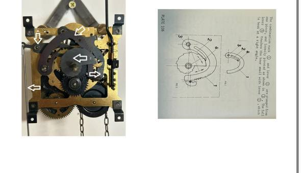
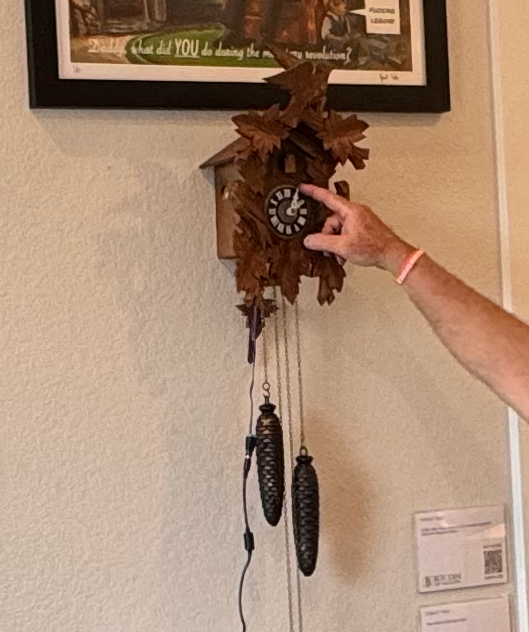
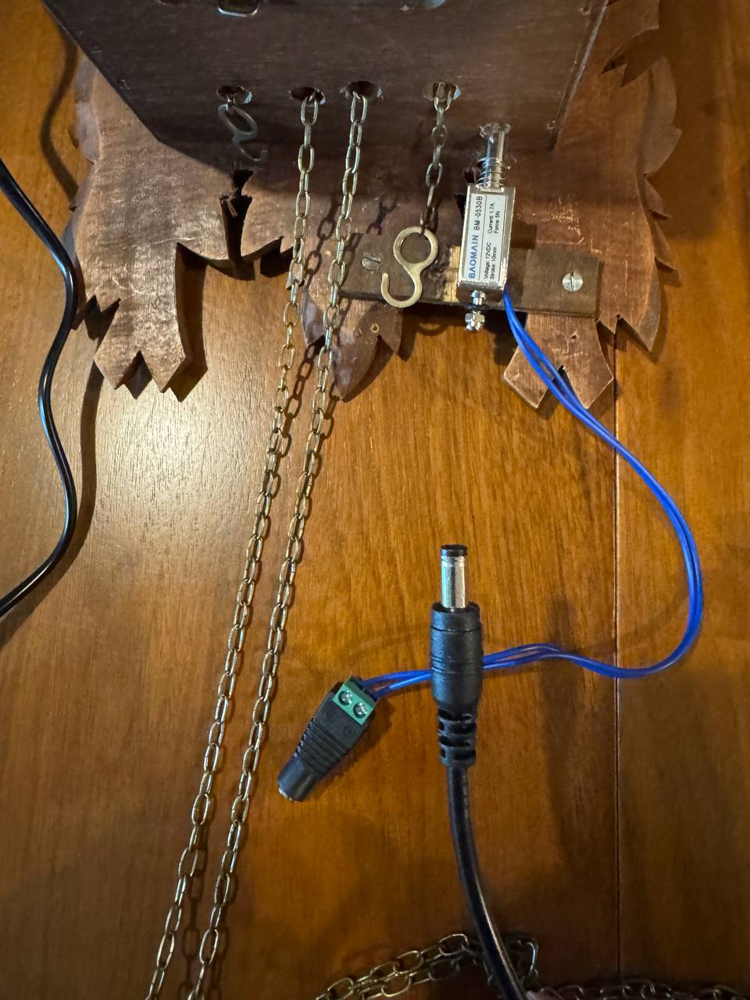
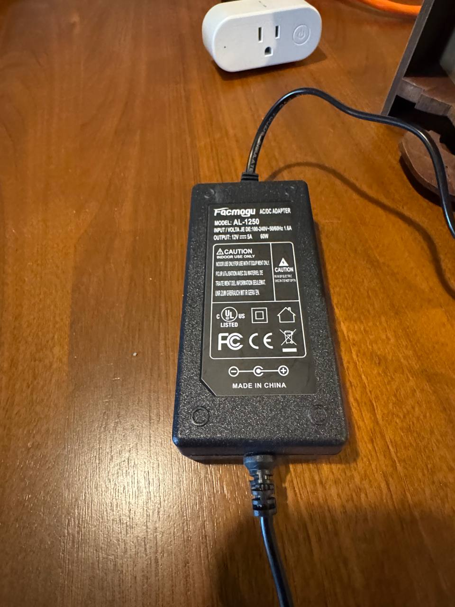

# Hardware — Clock Modification

## What This Does

A cuckoo clock is modified so that whenever a Bitcoin Lightning payment arrives,
an electromagnet pulls on the clock's chime gear, triggering the full cuckoo chime
cycle — exactly as if the clock had struck the hour on its own.

The clock's internal mechanism is **not permanently modified**. The electromagnet
is externally mounted against the gear. The clock still keeps time and chimes
normally on the hour.

---

## How It Triggers

```
Wall outlet
    └── Shelly Plus Plug US  (switched on/off via WiFi HTTP API)
            └── 12V ~2A power supply  (barrel jack)
                    └── Electromagnet
                            └── Mounted against chime gear inside cuckoo clock
```

1. A Lightning payment arrives → LNbits fires a webhook → Python script runs
2. The script sends an HTTP POST to the Shelly outlet to turn it ON
3. The Shelly powers the 12V PSU → current flows through the electromagnet
4. The magnet pulls the chime gear → the clock's cuckoo mechanism fires
5. After a configurable delay the script turns the Shelly OFF
6. The Shelly also has a hardware `auto_off` timer (2 seconds) as a failsafe —
   the magnet can never be left energized if the software fails

The `auto_off` safety timer is configured automatically by the Ansible playbook
(`ansible/deploy.yml`), but can also be set manually:

```bash
curl -X POST http://172.16.4.55/rpc/Switch.SetConfig \
  -H "Content-Type: application/json" \
  -d '{"id":0,"config":{"auto_off":true,"auto_off_delay":2}}'
```

---

## Parts List

| Part | Details | Approx. Cost |
|---|---|---|
| Cuckoo clock | Any standard cuckoo clock with a gear-driven chime mechanism | varies |
| Electromagnet | [Baomain BM-0530B (JF-0530B)](https://www.amazon.com/dp/B01K41EZAU?th=1) — DC 12V, 950mA, 5N force, 10mm stroke, 30×15.6×13mm, 35g, push-pull, spring return, open frame | ~$8 |
| 12V ~2A power supply | Barrel jack (5.5mm × 2.1mm), center positive, generic | on-hand / ~$10 |
| Shelly Plus Plug US | Smart outlet — HTTP API + WiFi, controls the 12V PSU | ~$20 |
| Barrel jack cable | Male barrel jack to screw terminals or bare wire | ~$2 |
| Mounting hardware | Small screws or zip ties to attach the electromagnet | ~$1 |

**Total estimated cost (excluding clock): ~$44**

---

## How the Chime Mechanism Works

The clock movement is powered by gravity. A 420 gram weight powers this 8-day
cuckoo movement. An electromagnet is attached to the outside of the case below
the cuckoo movement, connected to a smart switch that receives an impulse from a
Bitcoin payment.

When power is sent to the electromagnet, the **Pull-down rod (1)** is pulled.
This lifts the **Rack Lift lever (4)**, which lifts the **Rack Hook (3)**,
freeing the rack and enabling it to fall on the **Snail Wheel (2)**.

The snail wheel has 12 shelves or levels. The lowest shelf is 12 o'clock (twelve
cuckoos); the highest shelf is 1 o'clock (one cuckoo). As the **Rack Hook (5)**
drops onto the snail wheel, it dictates how many cuckoos will be announced.

When power is removed from the electromagnet, the cuckoo process starts.



---

## Mounting the Electromagnet

1. Open the back panel of the cuckoo clock to expose the gear mechanism
2. Identify the gear that initiates the chime cycle (it will be pulled or nudged
   by the hour cam during a normal chime strike)
3. Position the electromagnet so its face is ~1–2mm from the target gear
4. Secure the electromagnet to the clock housing with small screws or zip ties —
   do not glue anything to the clock mechanism itself
5. Route the wires out the back panel and down to the barrel jack connector
6. Plug barrel jack into the 12V PSU output
7. Plug the PSU into the Shelly outlet

> **Tip:** Test the magnet position with a short `./start.sh outlet 1` pulse before
> closing up the clock. The gear should pull cleanly and release without binding.

---

## Configuring the Shelly Outlet

### Hardware

**Shelly Plus Plug US** — a WiFi smart outlet with a local HTTP/RPC API.
No cloud account required; it works entirely on your LAN.

- Product page: [Shelly Plus Plug US](https://www.shelly.com/en-us/products/shop/shelly-plus-plug-us)
- Rated for 120V AC, 15A max
- Controlled via HTTP POST to its local IP — no Shelly cloud, no MQTT needed

### Initial WiFi Setup

1. Plug the Shelly into a wall outlet
2. It broadcasts a WiFi hotspot named `ShellyPlusPlugUS-<mac>`
3. Connect your laptop/phone to that hotspot
4. Open `http://192.168.33.1` in a browser
5. Go to **Settings → WiFi** and join your local network
6. The Shelly reboots and gets an IP from your router

### Set a Static DHCP Lease

The IP must never change — if it does, the outlet control breaks silently.

In your router's DHCP settings, find the Shelly by its MAC address (printed on
the device) and assign it a permanent IP. The project uses `172.16.4.55`.

Update `SHELLY_HOST` in `main.py` and `start.sh` to match whatever IP you assign.

### Python API (ishelly)

This project uses the [`ishelly`](https://pypi.org/project/ishelly/) library
(already a dependency) rather than raw curl. The pattern used in `main.py`:

```python
from ishelly.client import ShellyPlug
from ishelly.components.switch import SwitchSetParams

p = ShellyPlug("172.16.4.55")

# Turn ON
p.switch.set(SwitchSetParams(id=0, on=True))

# Turn OFF
p.switch.set(SwitchSetParams(id=0, on=False))

# Get current state
status = p.switch.get_status(id=0)
print(status)
```

Run a quick interactive test from the project root:

```bash
uv run python -c "
from ishelly.client import ShellyPlug
from ishelly.components.switch import SwitchSetParams
p = ShellyPlug('172.16.4.55')
p.switch.set(SwitchSetParams(id=0, on=True))
import time; time.sleep(1)
p.switch.set(SwitchSetParams(id=0, on=False))
print('done')
"
```

Or use the built-in helper:

```bash
./start.sh outlet 1   # on for 1 second via ishelly
```

### Safety: auto_off Timer

The Shelly is configured with a hardware `auto_off` timer as a failsafe — if
the software crashes mid-pulse, the outlet turns itself off after 2 seconds
rather than leaving the electromagnet energized indefinitely.

The Ansible playbook sets this automatically. To set it manually with ishelly:

```python
from ishelly.client import ShellyPlug
from ishelly.components.switch import SwitchSetConfigParams, SwitchConfig

p = ShellyPlug("172.16.4.55")
p.switch.set_config(SwitchSetConfigParams(
    id=0,
    config=SwitchConfig(auto_off=True, auto_off_delay=2)
))
```

Or via the Ansible playbook (already configured in `ansible/deploy.yml`):

```bash
ansible-playbook -i ansible/inventory.ini ansible/deploy.yml --tags app
```

Verify via the Shelly web UI at `http://172.16.4.55` → **Settings → Switch**,
or check `p.switch.get_config(id=0)` returns `auto_off: true, auto_off_delay: 2`.

### Firmware

The Shelly should be running **firmware 1.x (Gen2)**. Update via the web UI at
`http://172.16.4.55` → **Settings → Firmware**. The RPC API used in this project
requires Gen2 firmware — the older Gen1 API (`/relay/0`) is not used.

### Testing

```bash
./start.sh outlet 1   # turn on for 1 second — should trigger a chime
./start.sh outlet 2   # turn on for 2 seconds
```

Watch the Shelly's LED: solid green = on, off = standby.

---

## v2 Build — Self-Contained (No Wall Outlet)

The v1 build requires a wall outlet and a 12V PSU brick. A cleaner alternative
eliminates both by switching to a Shelly that accepts 12V DC directly and adding
a small 12V battery — the entire electrical system lives inside or behind the clock.

### Why This Is Better

| | v1 (current) | v2 (self-contained) |
|---|---|---|
| Shelly device | Shelly Plus Plug US (120V AC) | Shelly 1 Mini Gen4 (12V DC) |
| Power path | Wall outlet → PSU → magnet | 12V battery → Shelly → magnet |
| PSU brick | Required | Eliminated |
| Wall outlet | Required | Not needed (only Pi needs power) |
| Concealable | No — large wall plug | Yes — fits inside clock body |

### Recommended Device

**[Shelly 1 Mini Gen4](https://www.shelly.com/en-us/products/shop/shelly-1-mini-gen4)** — ~$25

- Power input: **12–24V DC** (or 100–240V AC — but use DC here)
- Relay output: up to 8A — well above the electromagnet's 950mA draw
- Size: ~28 × 35mm — easily hidden behind the clock's back panel
- Same Gen2 RPC API — **no code changes needed**; `ishelly` works identically

### Battery

A **12V 1Ah sealed lead-acid (SLA)** battery (~$15) is a simple, safe choice:

- The electromagnet draws 950mA but only for ~1–2 seconds per chime
- A 1Ah battery at 50% depth of discharge = ~500 mAh usable ÷ ~20mAs per chime
  ≈ **~1,500 chimes** between charges (days to weeks of normal use)
- Add a small 12V trickle charger and the battery stays topped up permanently

Alternatively, a **3S LiPo (11.1V nominal, 12.6V full)** with a BMS is more
compact but requires more careful handling.

### Revised Wiring (v2)

```
12V battery
    └── Shelly 1 Mini Gen4  (switched on/off via WiFi HTTP API)
            └── Electromagnet
                    └── Mounted against chime gear inside cuckoo clock
```

### Revised Parts List (v2)

| Part | Details | Approx. Cost |
|---|---|---|
| Cuckoo clock | Any standard cuckoo clock with a gear-driven chime mechanism | varies |
| Electromagnet | [Baomain BM-0530B (JF-0530B)](https://www.amazon.com/dp/B01K41EZAU?th=1) — DC 12V, 950mA, 5N force, 10mm stroke | ~$8 |
| 12V 1Ah SLA battery | Standard sealed lead-acid, e.g. YUASA NP1-12 or equivalent | ~$15 |
| 12V trickle charger | 300–500mA float charger | ~$10 |
| Shelly 1 Mini Gen4 | Tiny relay, 12V DC input, WiFi, same RPC API | ~$25 |
| Mounting hardware | Small screws or zip ties | ~$1 |

**Total estimated cost (excluding clock): ~$59** (vs ~$44 for v1, but no outlet required)

### Code Changes for v2

None. The `ishelly` API is identical across all Shelly Gen2/Gen3/Gen4 devices.
Only the `SHELLY_HOST` IP needs to point to the new device after WiFi setup.

The `auto_off` safety timer applies the same way:

```python
from ishelly.client import ShellyPlug
from ishelly.components.switch import SwitchSetConfigParams, SwitchConfig

p = ShellyPlug("172.16.4.55")  # update IP to match your Shelly 1 Mini
p.switch.set_config(SwitchSetConfigParams(
    id=0,
    config=SwitchConfig(auto_off=True, auto_off_delay=2)
))
```

---

## Photos





See [`photos/`](photos/) for additional build photos.

---

## 3D Printed Parts

See [`3d-parts/`](3d-parts/) for printable mounting brackets and enclosures
(planned — not yet available).
